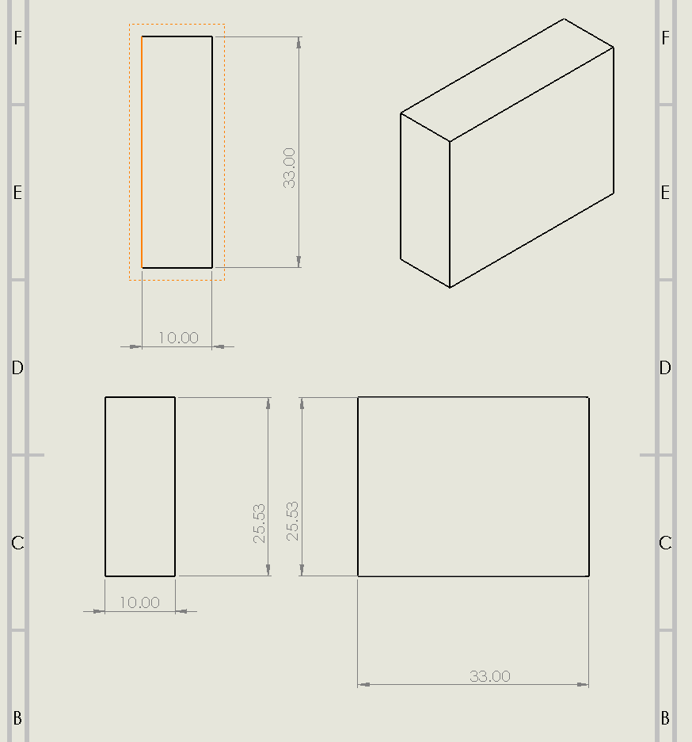
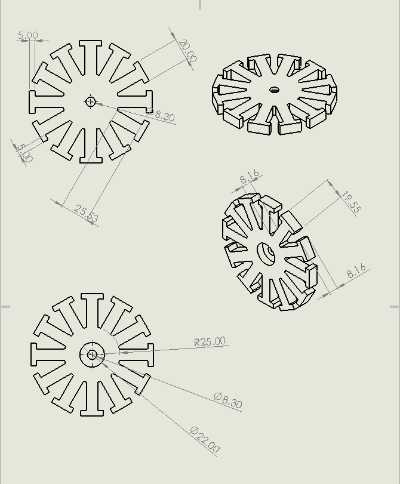

#  Diseño de Motor Brushless (BLDC)

##  Descripción del proyecto

Este proyecto documenta el diseño y desarrollo de un **motor brushless (BLDC)**, enfocado en el modelado mecánico de sus componentes principales y su integración en un sistema funcional.

El objetivo es analizar, diseñar y estructurar un motor eléctrico eficiente, presentando:

* Modelado 3D de los componentes
* Dimensiones y geometría del sistema
* Ensamble del motor
* Base para futuras simulaciones y validaciones

---

##  Objetivos

* Diseñar un motor brushless desde un enfoque mecánico y conceptual
* Desarrollar modelos 3D del rotor, estator y componentes asociados
* Documentar dimensiones y relaciones entre piezas
* Establecer una base para análisis electromagnético y simulaciones futuras

---

## Contexto técnico

Los motores brushless (BLDC) son ampliamente utilizados en aplicaciones modernas debido a su alta eficiencia, bajo mantenimiento y larga vida útil.

Se emplean en:

* Sistemas de propulsión (drones)
* Robótica
* Vehículos eléctricos
* Automatización industrial

---

##  Componentes diseñados

El proyecto incluye el diseño de:

* Rotor
* Estator
* Separador / estructura de soporte

Cada componente ha sido modelado considerando criterios de ensamblaje, geometría y funcionalidad.

---

## Vista preliminar del diseño







##  Estado actual del proyecto

*  Modelado 3D del rotor
*  Modelado 3D del estator
*  Diseño del separador
*  Definición conceptual del motor

---


##  Estructura del repositorio

```bash
images/
 └── renders/

cad/
docs/
manufacturing/
```

---

##  Autor

**David Esteban**
Ingeniería Mecatrónica

---

##  Licencia

Este proyecto está bajo la licencia MIT.
