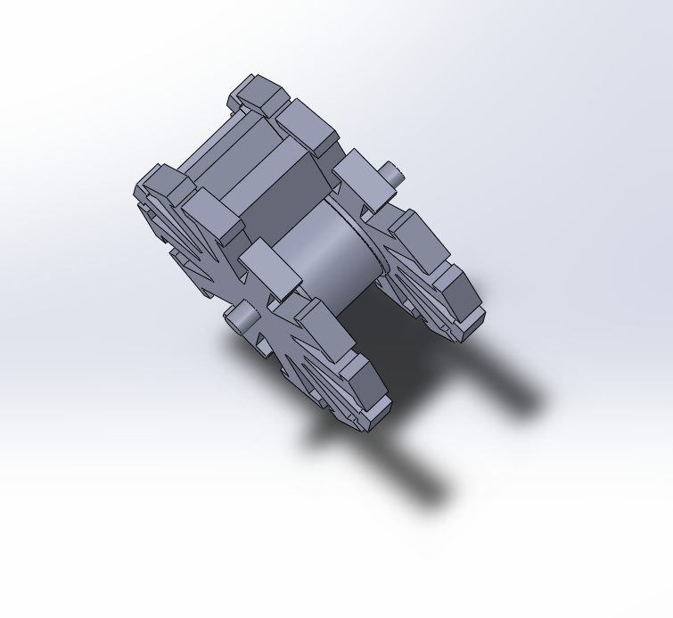
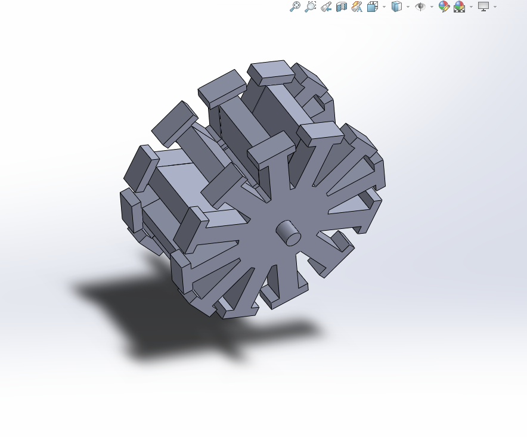
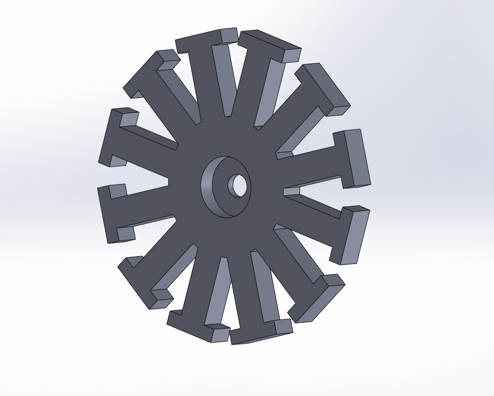
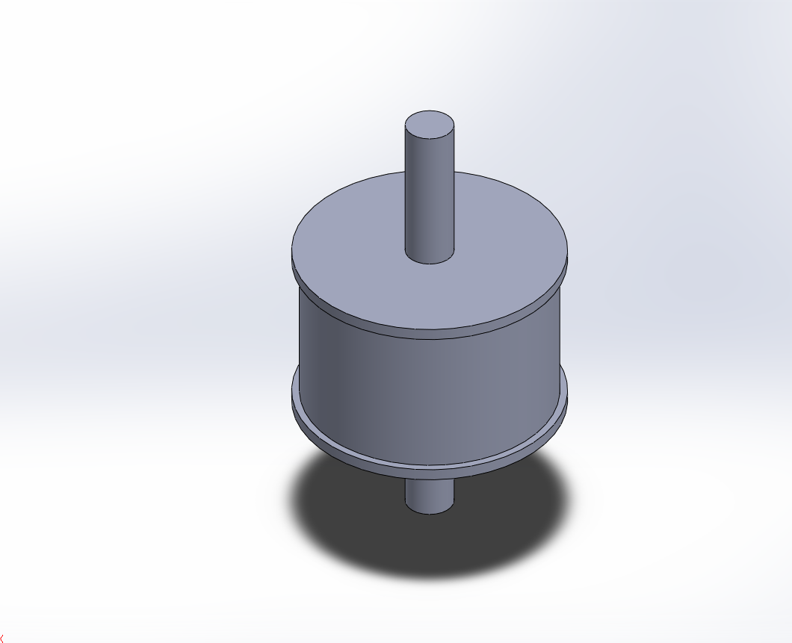
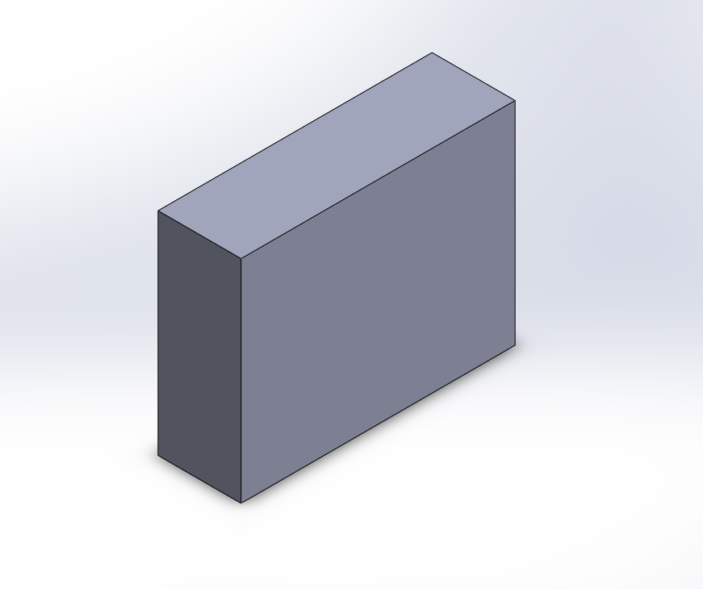
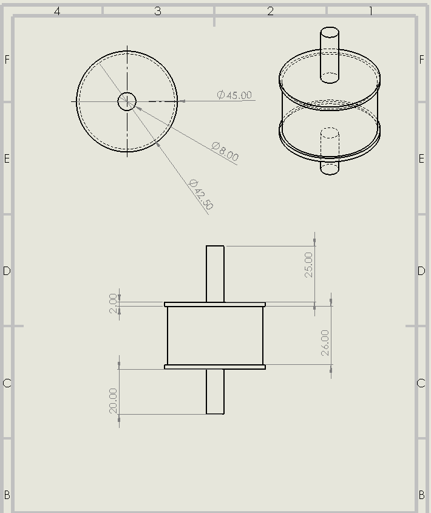

#  Diseño de Motor Brushless (BLDC)

##  Descripción del proyecto

Este proyecto documenta el diseño y desarrollo de un **motor brushless (BLDC)**, enfocado en el modelado mecánico de sus componentes principales y su integración en un sistema funcional.

El objetivo es analizar, diseñar y estructurar un motor eléctrico eficiente, presentando:

* Modelado 3D de los componentes
* Dimensiones y geometría del sistema
* Ensamble del motor
* Base para futuras simulaciones y validaciones

---

##  Objetivos

* Diseñar un motor brushless desde un enfoque mecánico y conceptual
* Desarrollar modelos 3D del rotor, estator y componentes asociados
* Documentar dimensiones y relaciones entre piezas
* Establecer una base para análisis electromagnético y simulaciones futuras

---

## Contexto técnico

Los motores brushless (BLDC) son ampliamente utilizados en aplicaciones modernas debido a su alta eficiencia, bajo mantenimiento y larga vida útil.

Se emplean en:

* Sistemas de propulsión (drones)
* Robótica
* Vehículos eléctricos
* Automatización industrial

---

##  Componentes diseñados

El proyecto incluye el diseño de:

* Rotor
* Estator
* Separador / estructura de soporte

Cada componente ha sido modelado considerando criterios de ensamblaje, geometría y funcionalidad.

---
## Diseño y componentes del motor

A continuación se presentan los principales componentes del motor brushless diseñados en este proyecto, junto con su función dentro del sistema.

---

###  Ensamble general




En las imágenes anteriores se muestra el **ensamble completo del motor**, donde se integran los componentes principales: rotor, estator y separador.

Este conjunto permite visualizar la disposición espacial de las piezas y validar aspectos como:

* Ajuste entre componentes
* Espacios de trabajo del rotor
* Integración mecánica del sistema

---

###  Estator



El **estator** corresponde a la parte fija del motor brushless.

Su función principal es:

* Soportar el sistema de bobinado
* Generar el campo electromagnético cuando es energizado

El diseño del estator considera la geometría necesaria para alojar las bobinas y permitir una correcta interacción con el rotor.

---

###  Rotor



El **rotor** es la parte móvil del motor y es responsable de generar el movimiento.

Este componente:

* Interactúa con el campo magnético del estator
* Produce el giro del eje del motor

Su diseño es crítico, ya que influye directamente en:

* La eficiencia del motor
* El torque generado
* La estabilidad del sistema

---

###  Separador



El **separador** es un componente diseñado para:

* Mantener la distancia adecuada entre el estator y el rotor
* Facilitar el proceso de bobinado
* Garantizar el correcto posicionamiento de las bobinas

Además, contribuye a evitar interferencias mecánicas entre las partes móviles y fijas del sistema.

---

##  Planos y dimensiones

A continuación se presentan las dimensiones principales de cada componente, expresadas en milímetros (mm):

---

###  Dimensiones del estator


En esta imagen se detallan las dimensiones del estator, las cuales definen:

* El espacio disponible para el bobinado
* El diámetro interno y externo
* La relación geométrica con el rotor

Estas medidas son fundamentales para garantizar un correcto acople y funcionamiento del sistema.

---

###  Dimensiones del rotor



Se presentan las dimensiones del rotor, incluyendo:

* Diámetro
* Espesor
* Geometría general

Estas características influyen directamente en el comportamiento dinámico del motor y en la generación de torque.
el diametro donde iran los imanes influye las medidas del iman que se vaya usar, se recomienda usar imanes de referencia 541N y 540S
la configuracion de los imanes debe ir estrictamente de la siguiente manera: 541N-540S-541N-540S...

---

### 📏 Dimensiones del separador


En esta sección se muestran las dimensiones del separador, diseñado para:

* Mantener tolerancias adecuadas entre componentes
* Permitir el correcto ensamblaje del sistema
* Facilitar la manufactura y montaje

---

## Nota técnica

El diseño de cada componente se realizó considerando criterios de:

* Integridad estructural
* Compatibilidad geométrica
* Funcionalidad dentro del sistema electromecánico

Este conjunto de piezas constituye la base para futuras etapas de simulación, validación y construcción física del motor.


##  Estado actual del proyecto

*  Modelado 3D del rotor
*  Modelado 3D del estator
*  Diseño del separador
*  Definición conceptual del motor

---


##  Estructura del repositorio

```bash
images/
 └── renders/

cad/
docs/
manufacturing/
```

---

##  Autor

**David Esteban**
Ingeniería Mecatrónica

---

##  Licencia

Este proyecto está bajo la licencia MIT.
